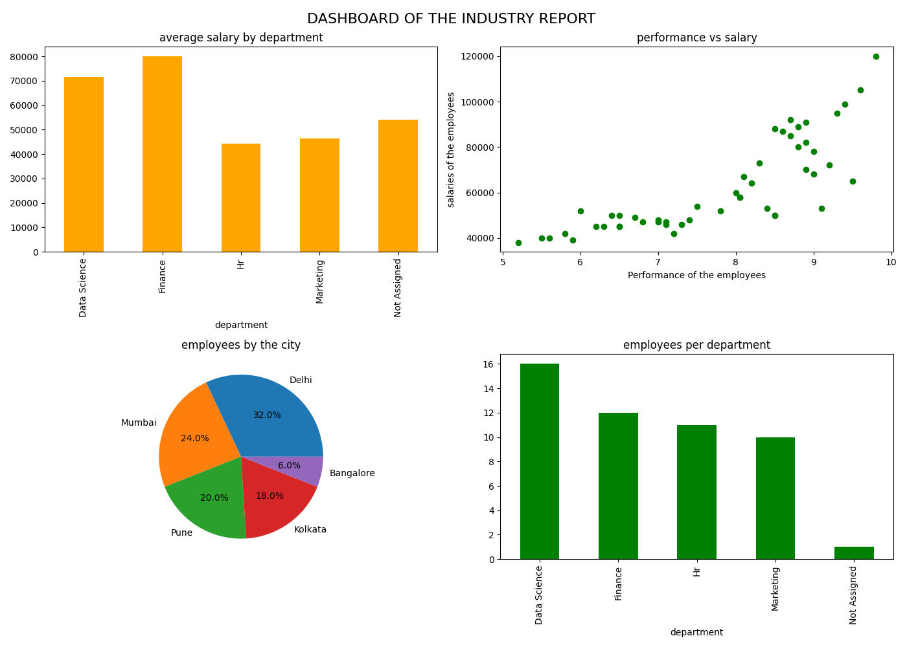

# 📊 Employee Data Analysis & Visualization Dashboard

## 📌 Project Overview

This project focuses on analyzing a real-world employee dataset using Python. The dataset contained missing values, inconsistent formatting, and outliers, which were handled using data cleaning techniques in Pandas.

After preprocessing, a dashboard was created using Matplotlib to visualize key business insights such as salary distribution, performance relationships, and employee distribution across departments and cities.

---

## 🛠️ Tools & Technologies

* Python
* Pandas
* Matplotlib

---

## 🔧 Data Cleaning Steps

* Removed leading/trailing spaces and standardized text data
* Handled missing values using mean, median, and mode
* Converted columns to appropriate data types
* Detected and removed outliers using IQR method
* Created a new feature `experience_years` from joining date

---

## 📊 Key Insights

* Data Science department has the highest average salary
* Positive relationship between performance score and salary
* Employees are distributed across multiple cities
* Department-wise employee distribution highlights workforce structure

---

## 📷 Dashboard Preview

---

## 🎯 Outcome

This project demonstrates strong skills in:

* Data cleaning
* Exploratory Data Analysis (EDA)
* Data visualization

It reflects the practical workflow of a data analyst in real-world scenarios.

---

## 📁 Files in Repository

* `data_cleaning.py` → Main analysis and visualization code
* `hard_dataset.csv` → Dataset used for analysis
* `DASHBOARD.png` → Final dashboard output

---

## 🚀 Future Improvements

* Add interactive dashboards using Power BI or Tableau
* Apply machine learning models for prediction
* Enhance visualization using Seaborn

---

